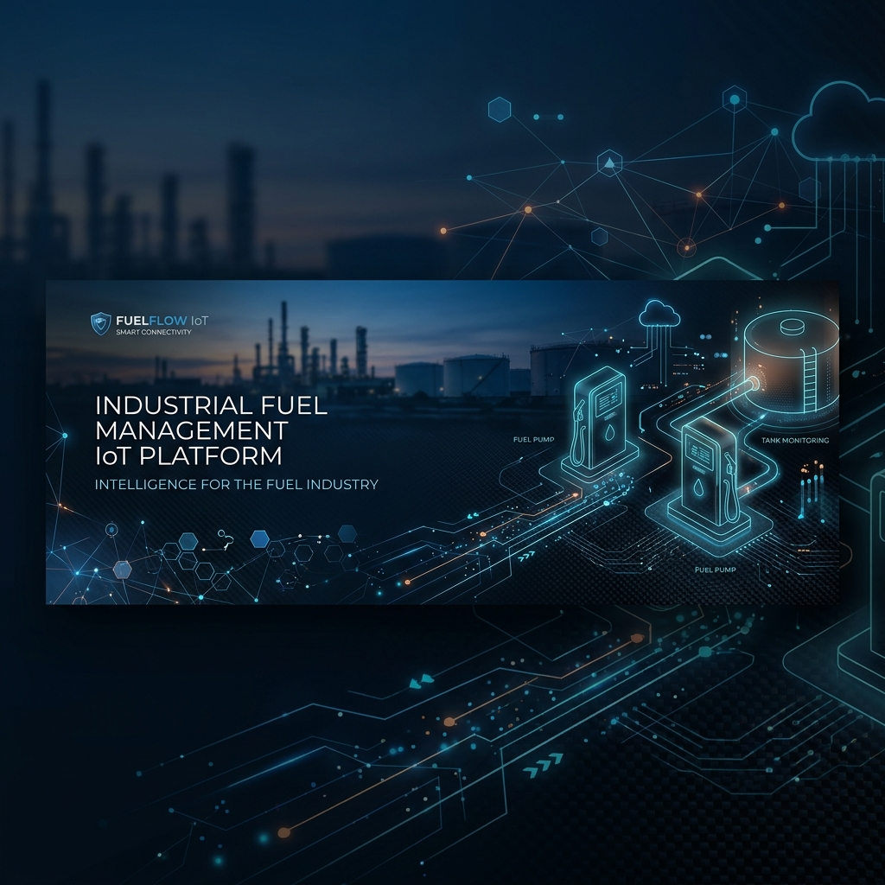

# <p align="center">⛽ Fuel IoT Platform</p>

<p align="center">
  
</p>

<p align="center">
  <strong>Industrial-grade, offline-first fuel dispensing ecosystem.</strong><br>
  Designed for the future of forecourt automation, cloud-connected intelligence, and hardware-agnostic operations.
</p>


---

## 🚀 Overview

The **Fuel IoT Platform** is a sophisticated monorepo architecture designed to handle the complexities of industrial fuel management. It provides a seamless bridge between physical fuel pumps and cloud-based analytics, ensuring operational continuity even in low-connectivity environments.

### ✨ Key Capabilities

- 🌍 **Multi-Tenant Cloud**: Scalable backend to manage multiple fuel stations and regions.
- 📶 **Offline-First**: Desktop operations continue without interruption during network outages.
- 🔌 **Pump Abstraction**: Hardware-independent layer supporting diverse industrial protocols.
- 📦 **Monorepo Architecture**: Shared logic and types across mobile, web, and desktop.
- 🔄 **Intelligent Sync**: Queue-based replication with automatic conflict resolution.

---

## 🏗️ Architecture Layout

The project leverages a modern monorepo structure powered by **Turborepo** for lightning-fast builds and modularity.

```txt
fuel-iot-platform/
├── 📱 apps/
│   ├── backend-api/        # Cloud-scale Node.js API
│   ├── desktop-app/        # Electron-based station controller
│   ├── device-simulator/   # Pump & sensor hardware mocking
│   └── web-dashboard/      # Next.js administrative portal
├── 📦 packages/
│   ├── analytics-engine/   # Data processing and reporting logic
│   ├── auth/               # Unified authentication service
│   ├── billing-engine/     # Transaction and invoicing logic
│   ├── device-core/        # Hardware interface contracts
│   ├── shared-types/       # TypeScript interface definitions
│   ├── sync-engine/        # Offline-to-Cloud replication logic
│   └── ui/                 # Shared design system components
└── ...
```

---

## 🛠️ Tech Stack

| Layer | Technologies |
| :--- | :--- |
| **Framework** | [Turborepo](https://turbo.build/), [Vite](https://vitejs.dev/) |
| **Frontend** | [React](https://reactjs.org/), [Tailwind CSS](https://tailwindcss.com/) |
| **Backend** | [Node.js](https://nodejs.org/), [TypeScript](https://www.typescriptlang.org/) |
| **Database** | [SQLite](https://www.sqlite.org/) (Local), [PostgreSQL](https://www.postgresql.org/) (Cloud) |
| **IoT** | [MQTT](https://mqtt.org/), [Electron](https://www.electronjs.org/) |

---

## 🗺️ Strategic Roadmap

- [x] **Phase 1**: Monorepo Foundation & Workspace Setup
- [ ] **Phase 2**: Core Device Contracts & UI Primitive Library
- [ ] **Phase 3**: Backend Infrastructure, Prisma Schema & Auth
- [ ] **Phase 4**: Electron Desktop Shell with Local Persistence
- [ ] **Phase 5**: Sync Engine & MQTT Hardware Integration
- [ ] **Phase 6**: Advanced Analytics & Tenant Billing Modules

---

## ⚡ Quick Start

```bash
# Install dependencies
npm install

# Start development environment
npm run dev

# Build all applications
npm run build
```

---

<p align="center">
  Built with ❤️ by the Pankaj
</p>
